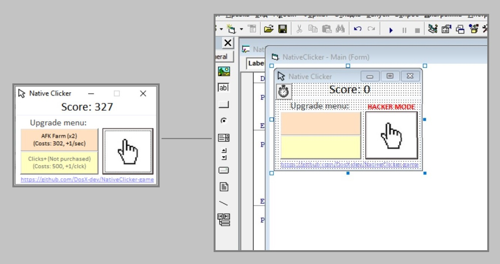

# 🖱 NativeClicker
A simple clicker game with a graphical interface on VB6. Very legacy!

This is my very old VB6 project. **I created it when I was a child 👦** and then made adjustments to the interface a couple of times in 2021 (just for fun)

### [Download compiled as .EXE](https://github.com/DosX-dev/NativeClicker-game/releases/tag/Builds)

| Requirement | Minimum |
|---|---|
| Operating system | Windows 95
| Processor | Any 500+ MHz CPU
| Memory | 500 kb
| Hard drive space | 20 kb free
